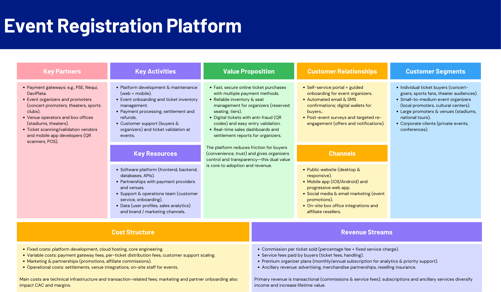

# Event Registration Platform — Software Engineering Workshop 1

## Overview
This repository contains the project developed for **Workshop 1** of the **Software Engineering Seminar** at *Universidad Distrital Francisco José de Caldas*.  
The project focuses on the design and conceptual modeling of a **digital event management and ticketing platform**, inspired by real-world systems such as *TuBoleta.com*.  

The platform aims to simplify how event organizers create and manage events, while offering attendees a secure and intuitive way to discover, purchase, and access tickets.  
It integrates core software engineering artifacts to represent both the business and technical perspectives of the system.

---

## Team Members
- **Carlos Andres Abella**  
- **Daniel Felipe Paez**  
- **Leidy Marcela Morales**  
**Supervisor:** Carlos Andrés Sierra  
**Date:** October 5, 2025  
**Location:** Bogotá D.C., Colombia  

---

## Project Structure

### 1. Introduction
The report begins by identifying the increasing complexity of **event organization and registration** in a digital environment.  
Traditional methods lead to issues such as:
- Lost revenue due to manual processes.  
- Poor communication between organizers and attendees.  
- Limited event visibility.  
- High operational costs.

The proposed **Event Registration Platform** addresses these challenges by providing a centralized digital solution for event creation, management, and ticket sales.

---

### 2. Business Model Canvas
The **Business Model Canvas** presents a strategic view of the platform’s ecosystem.  
It defines the **value proposition**, **key activities**, **resources**, **partners**, **customer segments**, and **revenue streams**, aligning business strategy with system design.

**Figure 1. Business Model Canvas**  

---

### 3. User Stories
User stories were created for the three main user roles, following the agile format:  
`As a [role], I want to [action], so that [benefit].`  

#### Event Organizer
- **Create and Publish Event:** Enables organizers to publish events with detailed information, seating options, and prices.  
- **View Real-Time Dashboard:** Provides live statistics of ticket sales and revenue.

#### Ticket Buyer
- **Browse and Discover Events:** Allows users to search for events by name, date, or category.  
- **Purchase Event Ticket:** Lets users select and buy tickets securely, receiving digital tickets via email.

#### Platform Admin
- **Suspend Organizer Account:** Allows administrators to manage fraud prevention and suspend problematic accounts.

These stories define the main functionalities and acceptance criteria to ensure a user-centered design approach.

---

### 4. User Story Mapping
The **User Story Mapping** technique was applied to structure and prioritize functionalities according to user interactions.  
It organizes the system into **five main epics**:
1. **Account Management** — user registration, login, and profile management.  
2. **Event Creation & Publishing** — event setup and ticket definition.  
3. **Event Discovery** — browsing and filtering of available events.  
4. **Ticket Selection & Purchase** — selecting tickets, checkout, and payment.  
5. **Monitoring & Administration** — dashboard and account control.

Each epic was divided into **features** and planned across **releases (MVP → Release 2 → Release 3)** to support incremental development.

**Figure 2. User Story Mapping**  

---

### 5. CRC Cards
To initiate the object-oriented design, **CRC (Class–Responsibility–Collaborator)** cards were defined for the main domain classes:

#### Class: Event
- Manages event data such as venue, date, and tickets.  
- Tracks availability, pricing, and sales.  
- Collaborates with `User` and `Ticket` classes.

#### Class: User
- Handles authentication and role-based behavior (Organizer, Buyer, Admin).  
- Manages profiles, purchases, and notifications.

#### Class: Ticket
- Represents purchased tickets with seat information, price, and QR code.  
- Handles validation and links to payment confirmation.

These classes form the conceptual basis for future class diagrams and software implementation.

---

## Deliverables Summary
| Section | Artifact | Purpose |
|----------|-----------|----------|
| **1. Introduction** | Problem & Objectives | Defines the motivation and goals of the system. |
| **2. Business Model Canvas** | Strategic Overview | Aligns business structure with technical design. |
| **3. User Stories** | Agile Requirements | Captures user needs for organizers, buyers, and admins. |
| **4. User Story Mapping** | Functional Flow Map | Prioritizes and sequences system features. |
| **5. CRC Cards** | Class Modeling | Establishes the foundation for object-oriented design. |

---

## Key Insights
- The **User Story Mapping** technique allowed for a structured visualization of the system’s workflow, ensuring that feature development aligns with user value.  
- The **Business Model Canvas** ensured the solution remains viable from both business and technical perspectives.  
- The **CRC Cards** served as the first bridge between the functional requirements and object-oriented implementation.

---

## Repository Files

- Workshop1Seminar.pdf # Final report document
- Business_Model_Canvas_Planning.png # Business Model Canvas diagram
- User_Story_Mapping.png # User Story Mapping diagram
- README.md # This documentation file
## Conclusion
This workshop guided the team through the early stages of software design by applying structured and user-centered methodologies.  
The resulting artifacts—from business modeling to user mapping and class design—provide a strong conceptual foundation for the future implementation of the **Event Registration Platform**.

**Date Completed:** October 2025  
**Course:** Software Engineering Seminar — Universidad Distrital Francisco José de Caldas  
