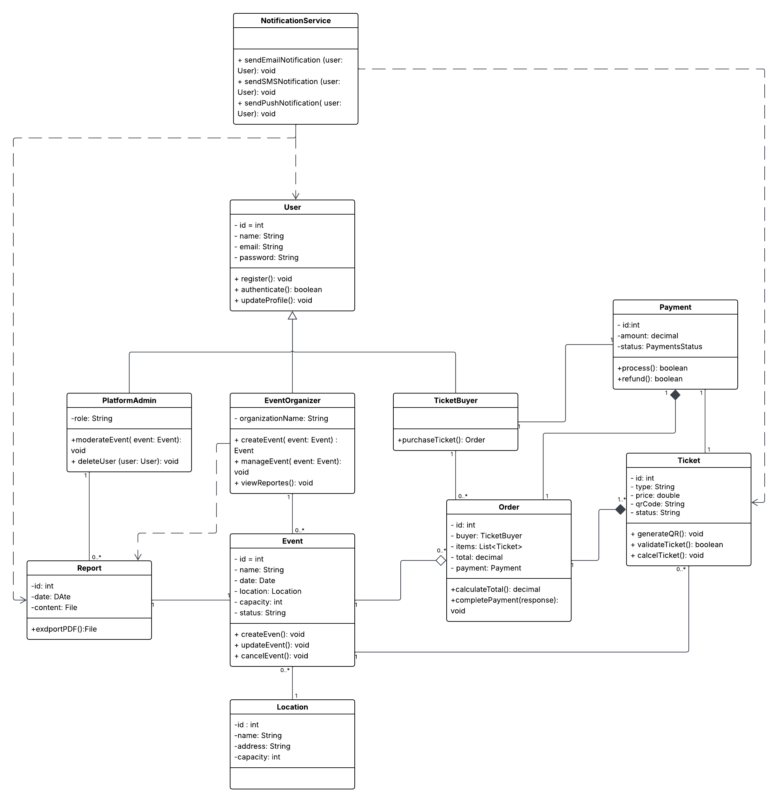
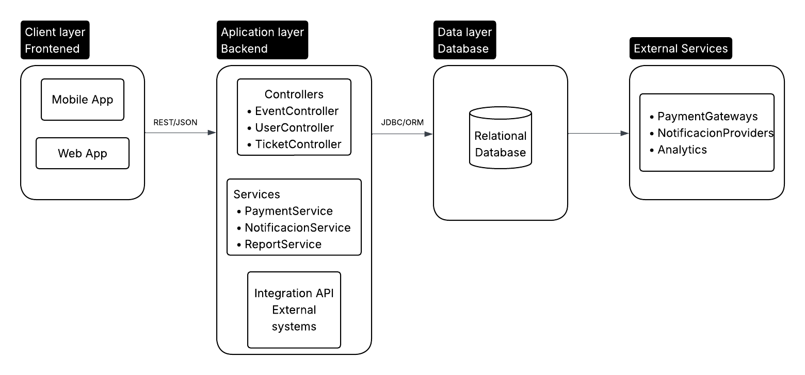
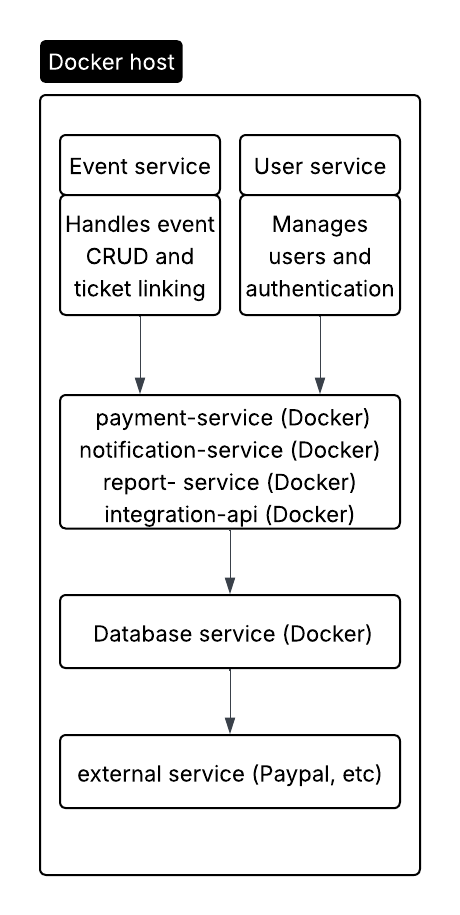
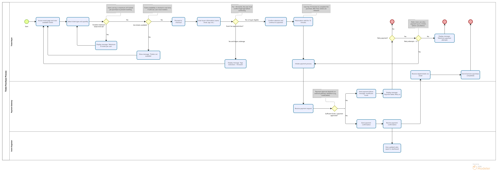
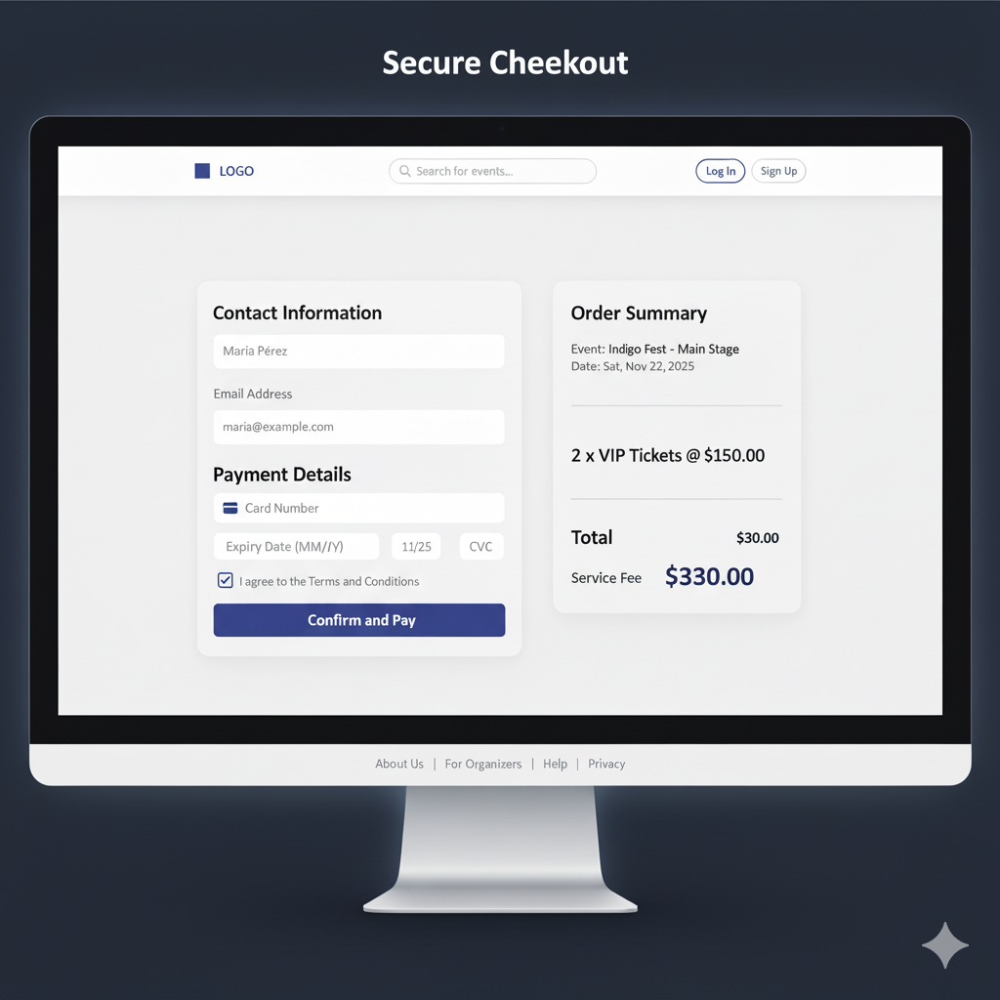
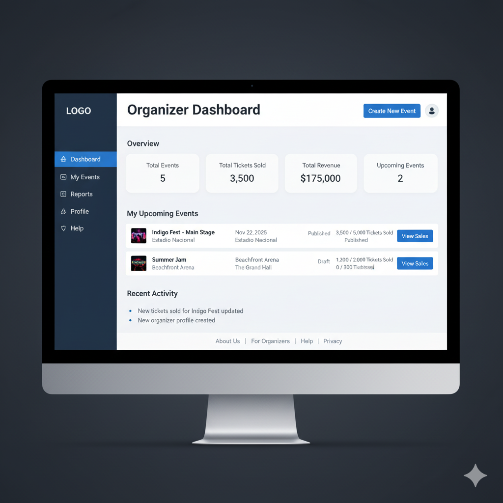

# Event Management Platform – Workshop 2

## Class Diagram

The **Class Diagram** represents the structural foundation of the platform.  
It defines the relationships between main entities — such as **Event**, **Ticket**, **Order**, **Payment**, and **User** — and how they interact under an object-oriented approach.  

Key principles applied include:
- **Encapsulation and inheritance:** User hierarchy with roles (Organizer, Buyer, Admin).  
- **Composition:** Each `Order` contains multiple `Tickets`, each linked to a `Payment`.  
- **Modularity:** Classes are independent but cohesive, ensuring maintainability.

---

## Architecture Diagram

The system architecture follows a **three-tier model** composed of:
1. **Presentation Layer:** Web interface accessed by end users.  
2. **Application Layer:** Core logic and service modules such as payment, notifications, and reports.  
3. **Data Layer:** Manages persistent entities (users, events, tickets).

This modular and containerized architecture (Docker-based) guarantees **scalability**, **security**, and **integration** with external APIs (payments, notifications, analytics).

---

## BPMN Diagram: Ticket Purchase Process

The **BPMN diagram** models the core business process — the **Ticket Purchase Flow** — involving three main actors:  
**Ticket Buyer**, **Event Organizer**, and **Payment Gateway**.

The process focuses on user-visible actions and decision points, ensuring clarity and real-world accuracy.

### Main Restrictions
- **Max 6 tickets per transaction** – to prevent reselling.  
- **Real-time availability validation** – avoids overbooking.  
- **Age restriction confirmation** – for +18 events.  
- **10-minute payment window** – before automatic release.  
- **External payment authorization** – determines transaction success.  
- **Max 3 retries per failed payment** – ensures reliability.

These rules are modeled as text annotations within the process to maintain **transparency** and improve communication between stakeholders.

---

## Web UI Mockups

The **mockups** illustrate the user interface of the Event Management Platform, aligning the functional models (BPMN and architecture) with usability principles.  
Each screen reflects a key stage of the user journey, focusing on clarity, consistency, and accessibility.

### Included Mockups

| Mockup | Description |
|--------|--------------|
| **Homepage** | Entry point for browsing and discovering upcoming events. |
| **Event Details** | Displays event info and allows ticket selection. |
| **Secure Checkout** | Payment form and order summary for completing the purchase. |
| **Purchase Confirmation** | Confirms the transaction and generates a digital ticket (PDF + QR). |
| **Organizer Dashboard** | Tracks total events, revenue, and ticket sales. |
| **Create New Event Form** | Interface for organizers to create and publish events. |

---

### Visual Overview

---

## Summary

This deliverable consolidates the **conceptual and structural design** of the Event Management Platform, integrating:
- Object-oriented modeling (Class Diagram).  
- Modular architecture for scalability.  
- BPMN process design emphasizing real-world interactions.  
- UI mockups demonstrating the final user experience.

These artifacts collectively form the foundation for the platform’s future **implementation and testing phases**.
